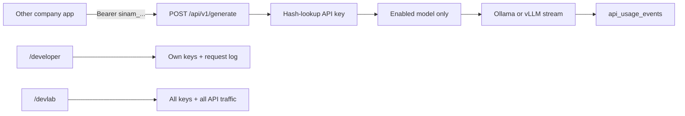

# Corporate API keys + Dev Lab

## Locked decisions

- **Custom SINAMGPT API** (not OpenAI/OpenRouter-compatible)
- **Raw model proxy only** — no knowledge inject, no guardrails on the API path
- Same local stack: Ollama/vLLM via existing [`src/lib/ollama`](src/lib/ollama) / LLM helpers, SQLite in [`src/lib/db.ts`](src/lib/db.ts)

## Product shape



## 1. Data model (SQLite)

Add tables in [`src/lib/db.ts`](src/lib/db.ts):

**`api_keys`**
- `id`, `user_id`, `name`, `key_prefix` (e.g. `sinam_ab12…`), `key_hash` (SHA-256 of full secret + `SESSION_SECRET` pepper), `is_enabled`, `last_used_at`, `revoked_at`, `created_at`
- Plaintext key shown **once** on create; never stored

**`api_usage_events`**
- `id`, `api_key_id`, `user_id`, `username`, `model`, `prompt_preview`, `prompt_chars`, `response_chars`, `ttft_ms`, `duration_ms`, `tokens_*`, `status` (`ok` | `error` | `aborted` | `rejected`), `error_message`, `ip`, `created_at`
- Separate from chat `usage_events` so Admin Live Usage stays chat-focused and Dev Lab owns API traffic

**Limits (app_settings)**
- `api_gateway`: `{ enabled, maxKeysPerUser: 5, maxRequestsPerMinute: 30, maxChars: 16000 }`

## 2. Custom public API

New routes under `src/app/api/v1/`:

| Route | Purpose |
|-------|---------|
| `GET /api/v1/models` | List models enabled for API (reuse admin enabled list) |
| `POST /api/v1/generate` | Raw generate / stream |

**Auth:** `Authorization: Bearer sinam_<secret>` (or `X-Api-Key`). Resolve user via key hash; reject revoked/disabled/missing.

**Request body (custom):**
```json
{
  "model": "gemma3:4b",
  "messages": [{ "role": "user", "content": "..." }],
  "stream": true
}
```

**Response:**
- `stream: true` → SSE events `{ type: "token" | "done" | "error", ... }` (same spirit as chat, but **no** citations / guardrail 422 path)
- `stream: false` → JSON `{ id, model, content, usage: { durationMs, ttftMs, ... } }`

**Explicitly skipped on this path:** `checkInputGuardrails`, `resolveKnowledgeContext`, conversation persistence.

**Rate limit:** per-key sliding window in memory (same idea as guest burst), return `429`.

**CORS:** allow configured origins from `api_gateway.corsOrigins` (default empty = same-origin / server-to-server only). Document that browser apps must be allowlisted.

Lib: [`src/lib/api-keys.ts`](src/lib/api-keys.ts) — create/list/revoke/authenticate; [`src/lib/api-usage.ts`](src/lib/api-usage.ts) — start/finish/list for API events.

## 3. User page — `/developer`

Parallel to chat, session-protected in [`src/middleware.ts`](src/middleware.ts).

- Generate key (name), show secret once + copy
- List keys (prefix, created, last used, enable/revoke)
- **My API requests** table: recent calls for own keys (status, model, latency, error)
- Short “how to call” snippet with base URL + sample `curl`

UI: `src/components/developer/` + `src/app/developer/page.tsx`. Link from chat header next to Admin/Lab (users see Developer; admins see all three).

## 4. Admin Dev Lab — `/devlab`

Separate top-level page like [`/lab`](src/app/lab/page.tsx) (not an Admin tab).

- **Overview:** requests today, error rate, top models, active keys
- **Keys:** all users’ keys — disable/revoke, filter by user
- **Requests:** live-ish + history of `api_usage_events` (filters: user, key, status, model)
- **Settings:** master enable, max keys/user, RPM, max chars, CORS origins

UI: `src/components/devlab/` + `src/app/devlab/page.tsx`. Admin-only middleware + `requireAdmin`.

## 5. Wire-up / i18n / docs

- EN + AZ strings in `src/messages/` (developer + devlab packs)
- ROADMAP: promote this as **Next active track**; CHANGELOG Unreleased
- README short section: corporate API keys, `/developer`, `/devlab`, example `curl`

## Out of scope for v1

- OpenAI-compatible `/v1/chat/completions`
- Knowledge / guardrails on API path
- Billing / paid quotas
- Per-key model allowlists (all enabled models allowed)
- Saving API chats into conversation history

## Implementation order

1. DB + `api-keys` / `api-usage` libs  
2. `POST/GET /api/v1/*` raw proxy + rate limit  
3. User `/developer` page  
4. Admin `/devlab` page  
5. Middleware, nav links, i18n, docs
