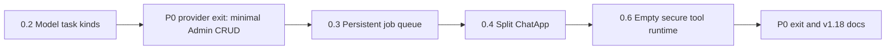

# Finish Phase 0

Complete P0 in dependency order while preserving current chat behavior. Each slice must pass unit tests, targeted lint, and `next build` before the next begins.

## 1. Add model task kinds (0.2)

- Add `ModelKind = chat | image | video | stt | tts | embedding | rerank` and `kind` to [`src/lib/llm/types.ts`](src/lib/llm/types.ts).
- Add a backward-compatible `models.kind TEXT NOT NULL DEFAULT 'chat'` migration in [`src/lib/db.ts`](src/lib/db.ts), including the provider-table rebuild shape. Persist the currently runtime-only `tts` flag at the same time.
- Create [`src/lib/llm/model-kind.ts`](src/lib/llm/model-kind.ts) with deterministic name inference. Specific task models (Whisper, Piper/Kokoro, embedding/rerank, image/video generators) must be classified before the default `chat` fallback.
- Update Ollama/vLLM listing and [`src/lib/settings.ts`](src/lib/settings.ts) sync. New rows receive inferred kinds; existing/admin-overridden kinds remain stable. Expose `getModelKind` and `isChatModel`.
- Only `kind=chat` models may appear in chat pickers/default-model selection or enter `/api/chat`, guest chat, and `/api/v1/chat/completions`; reject other kinds with a clear 400 response. Add `kind` to model API cards and Admin Models.
- Add inference/filter/route-helper tests. Existing models migrate to `chat`, so current behavior remains unchanged.

## 2. Satisfy the provider Admin exit criterion

The user selected a minimal Admin surface now; polished connection testing/sync remains P1.3.

- Extend [`src/lib/providers.ts`](src/lib/providers.ts) with safe create/update/delete rules and exported validation helpers. Protect `ollama` from deletion; prevent deleting referenced providers or disabling the final enabled provider.
- Add admin-only, Zod-validated routes at [`src/app/api/admin/providers/route.ts`](src/app/api/admin/providers/route.ts) and [`src/app/api/admin/providers/[id]/route.ts`](src/app/api/admin/providers/[id]/route.ts).
- Add [`src/components/admin/AdminProvidersPanel.tsx`](src/components/admin/AdminProvidersPanel.tsx) and an Admin tab: list, add second Ollama endpoint, edit URL, enable/disable, set/clear key, delete. Return only `hasApiKey`; never disclose plaintext or ciphertext.
- Permit LAN HTTP endpoints but block embedded credentials, queries/fragments, and cloud metadata addresses. Explain that the server connects to the configured URL. Keep vLLM unavailable until P1.
- Add EN/AZ/RU strings and provider-library tests. Models sync through the existing Models refresh.

## 3. Build the persistent in-process job queue (0.3)

- First read the installed Next.js 16 instrumentation/runtime guide under `node_modules/next/dist/docs/` before adding startup code.
- Add a `jobs` table in [`src/lib/db.ts`](src/lib/db.ts): owner, kind, queued/running/completed/failed/cancelled state, bounded progress, input JSON, result reference, error, cancellation flag, worker/lease fields, and lifecycle timestamps with ownership/status indexes.
- Create `src/lib/jobs/{types,store,worker,index}.ts` and `src/lib/jobs/handlers/`. Use an atomic SQLite claim, concurrency 1, heartbeat lease, stale-job recovery, `globalThis` singleton protection for HMR, and graceful stop/requeue.
- Start the worker from [`src/instrumentation.ts`](src/instrumentation.ts) in Node runtime, with lazy startup from jobs APIs as a development fallback.
- Add session-authenticated, owner-scoped APIs for create/list, get, cancel, and SSE events. Reuse [`src/lib/sse.ts`](src/lib/sse.ts); reconnect reads the DB source of truth. Rate-limit and cap queued jobs per user.
- Register only an internal/admin `demo.sleep` handler. Add a default-off internal `jobQueue` feature flag; no jobs UI in P0.
- Test atomic claims, ownership, cancellation, stale recovery, progress, abort, and single concurrency with in-memory SQLite/fake timers. Add an opt-in live script and verify one real 240-second job survives beyond a normal request.
- Document that the queue supports the single-process self-hosted Node deployment, not serverless or horizontal multi-instance operation.

## 4. Decompose `ChatApp.tsx` without behavior changes (0.4)

Work in low-risk extraction checkpoints; do not create independent stateful client roots.

- Move shared types/storage/SSE parsing into `chat-types.ts`, `chat-storage.ts`, and `parse-sse-chunk.ts`; reuse the parser where safe.
- Extract message attachments/content/actions/edit form/list/empty state into focused components.
- Extract composer attachment strip, drag overlay, mic controls, and the composer shell while retaining the existing [`ModelPicker.tsx`](src/components/chat/ModelPicker.tsx).
- Move stateful domains into typed hooks: models, conversations, projects, sharing, composer attachments/mic, message editing, and streaming. Preserve abort, send lock, optimistic IDs, error restoration, localStorage, focus, and cleanup behavior.
- Extract sidebar/header/share portal last; leave [`src/components/chat/ChatApp.tsx`](src/components/chat/ChatApp.tsx) as a 250–350-line orchestrator. Keep every extracted file below 400 lines where practical.
- Add tests for pure SSE/attachment/storage helpers. At each checkpoint run build and the available chat smoke suite; final manual regression covers send/stop/regenerate/rewrite/edit, image/mic, picker persistence, projects/share, mobile sidebar, theme/i18n, and hydration.

## 5. Add the empty secure tool runtime (0.6)

- Add `messages.tool_trace` migration and hydrate the optional bounded trace in [`src/lib/types.ts`](src/lib/types.ts) and [`src/lib/attachments.ts`](src/lib/attachments.ts).
- Create `src/lib/tools/`: typed definitions, code-only registry, JSON Schema validation, guard wrapper, loop, bootstrap, and public exports. Use Ajv for generic JSON Schema input/result validation and strict size/additional-property limits.
- Extend LLM message/options types and Ollama/vLLM adapters additively for tool definitions, calls, and results. Omit all tool fields when none are registered.
- Implement a capped (default 8) call/result loop with abort propagation, per-call timeout, unknown-tool handling, validated inputs/results, and a final no-tools pass when the cap is reached.
- Refactor guardrail inspection so tool payload checks do not invoke query-gloss or knowledge retrieval recursively. Run safety checks over every serialized tool input and output. Persist only bounded/redacted trace data; never persist detected secrets or raw large results.
- Add optional backward-compatible `tool_start`/`tool_end` SSE events. Integrate behind `registeredTools.length > 0`, model tool capability, and a default-off `toolCalling` flag. Ship [`src/lib/tools/bootstrap.ts`](src/lib/tools/bootstrap.ts) with zero registrations, so normal chat takes the exact existing path.
- Test empty registry/no-op behavior, duplicate names, schema rejection, blocked input/output, handler non-execution on block, abort, unknown tools, iteration cap, and trace redaction.

## 6. Phase exit and verification

- Run all unit tests, changed-file lint, repository lint (record only unrelated pre-existing failures), dependency audit, TypeScript, and production build.
- Exercise fresh and upgraded SQLite migrations against disposable databases; smoke the current Ollama model list/chat path and minimal provider Admin flow.
- Conduct security checks for provider SSRF/secret disclosure, jobs IDOR/DoS/path traversal, and tool prompt injection/data exfiltration (OWASP LLM01 and API access-control guidance).
- Mark 0.2/0.3/0.4/0.6 and P0 `done` in [`docs/PLATFORM-ROADMAP.md`](docs/PLATFORM-ROADMAP.md), move [`docs/ROADMAP.md`](docs/ROADMAP.md) to the next phase, and update README/HOW-IT-WORKS/CHANGELOG.
- Bump package/docs to **v1.18.0 only after every exit check passes**. Do not commit, tag, or push unless requested.