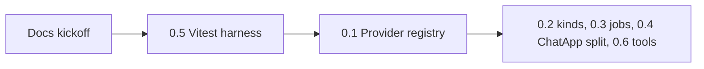
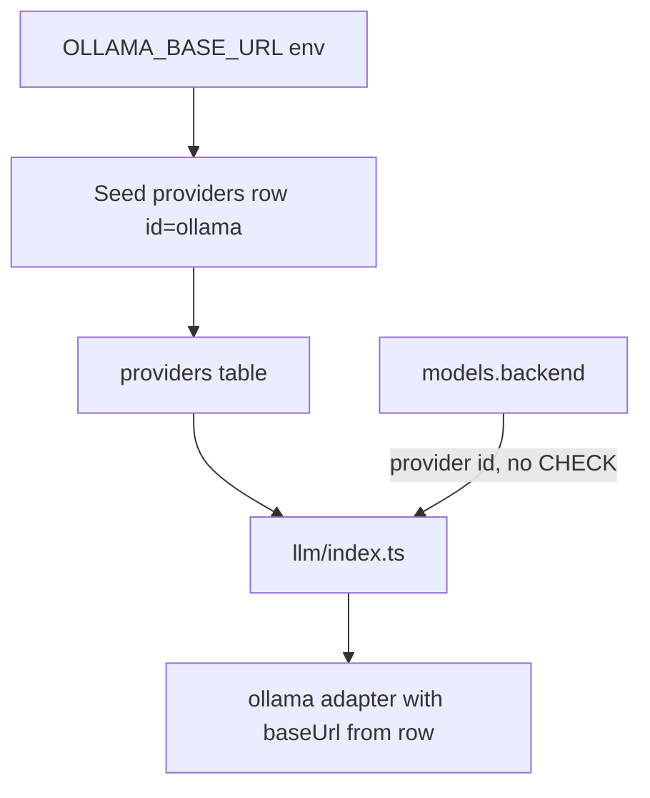

# P0 clean start — tests, then provider registry

P0 is enablement only: **nothing user-visible**, still **v1.17.0** until the whole phase ships as **v1.18**. We work one slice at a time. You chose **0.5 first** so later schema work has a regression net.

---

## Slice 0 — Mark the phase (docs only)

Per [docs/PLATFORM-ROADMAP.md](docs/PLATFORM-ROADMAP.md) “How to use this doc”:

- Set **P0** to `in progress`; set **0.5** to `in progress`.
- In [docs/ROADMAP.md](docs/ROADMAP.md) **Next active track**, put **P0 — Open the seams**, current item **0.5 Unit test harness**.
- Leave `package.json` at `1.17.0`. Add a one-line **Unreleased** note in [CHANGELOG.md](CHANGELOG.md) only when 0.5 actually ships.

---

## Slice 1 — 0.5 Unit test harness (this implementation)

Add Vitest (Node, no browser). Keep existing `npm run test:chat` as the live Ollama smoke suite.

**Config**

- Dev deps: `vitest`, `vite-tsconfig-paths` (so `@/` from [tsconfig.json](tsconfig.json) resolves).
- [vitest.config.ts](vitest.config.ts): `environment: "node"`, `include: ["src/**/*.test.ts"]`, `plugins: [tsconfigPaths()]`.
- Scripts: `"test": "vitest run"`, `"test:watch": "vitest"`.

**What we test (pure, no Ollama, no SQLite)**

| Module | Functions | Example cases |
|--------|-----------|---------------|
| [src/lib/llm/capabilities.ts](src/lib/llm/capabilities.ts) | `inferCapabilities`, `parseOllamaCapabilities` | Fleet tags: `gemma3:4b` vision, `gemma3:1b` no vision, every `gemma4:*` audio, `llama4:scout` vision no audio, `qwen3:32b` text-only; `/api/show` `["vision"]` merges with name heuristic |
| [src/lib/multilang.ts](src/lib/multilang.ts) | `normalizeMultilangText`, `tokenizeMultilang`, `tokensAlign`, `expandQueryTokens`, `looksLikeCompanyQuestion`, `detectReplyLanguage` | ASCII Azerbaijani still AZ; RU question tokens; company vs general chat (`what is AI` is not company) |
| [src/lib/knowledge.ts](src/lib/knowledge.ts) | scoring only | Extract a pure `rankKnowledgeDocs(docs, query, settings, opts)` from `retrieveKnowledge` (that function currently calls `listKnowledgeDocs()`). Cover: title/tag beats body; skip About on general chat; EN query can hit an AZ title via glossed tokens passed in `query` |
| [src/lib/guardrail-engine.ts](src/lib/guardrail-engine.ts) | `deobfuscateForSafety`, `inspectGuardrails` | `b0mb` / `h@ck`; injection / DAN; `sk-` secret. Mock `@/lib/query-gloss` so inspect never calls the LLM |

Files: `src/lib/llm/capabilities.test.ts`, `src/lib/multilang.test.ts`, `src/lib/knowledge.test.ts`, `src/lib/guardrail-engine.test.ts`.

**Done when:** `npm run test` is green and does not need Ollama or `data/owngpt.db`.

---

## Slice 2 — 0.1 Provider registry (next, after tests)

Do **not** start this until Slice 1 is merged and green. Goal: one default Ollama provider, existing chats unchanged.

- New `providers` table in [src/lib/db.ts](src/lib/db.ts): `id`, `kind`, `base_url`, `api_key_enc`, `enabled`. Seed `id='ollama'`, `kind='ollama'`, URL from env or `http://127.0.0.1:11434`, `enabled=1`.
- Rebuild `models` to **drop** `CHECK (backend IN ('ollama','vllm'))`. Existing `'ollama'` rows keep working because the default provider id is `'ollama'`.
- New [src/lib/providers.ts](src/lib/providers.ts): list / get / seed. Adapters in [src/lib/llm/ollama.ts](src/lib/llm/ollama.ts) take `baseUrl` from the row (env is seed-only).
- [src/lib/llm/index.ts](src/lib/llm/index.ts): `getEnabledBackends` / `pingBackends` / `listModels` read enabled providers by `kind`. `resolveModelBackend` reads `models.backend`.
- Widen `LlmBackend` in [src/lib/llm/types.ts](src/lib/llm/types.ts) to string (provider id); keep `kind` for adapter dispatch.
- **No full Admin → Providers page** (that is P1.3). P0.1 is schema + wiring + seed so a second row in the table is enough for code to see it.
- Encrypt `api_key_enc` with a key derived from `SESSION_SECRET`; never return the secret in JSON.
- vLLM stays **disabled** (`enabled=0` if we seed it). Do not flip `isVllmEnabled`.

**Done when:** restart with the current `.env.local` still lists/pings/chats on Ollama; `npm run test` and `npm run build` pass.

---

## Later P0 (not this start)

| Item | After |
|------|--------|
| 0.2 `models.kind` | Registry exists |
| 0.3 `jobs` + in-process worker | Tests + registry |
| 0.4 Split [ChatApp.tsx](src/components/chat/ChatApp.tsx) (~2.4k lines, target &lt;400) | Independent; can overlap after 0.1 |
| 0.6 `src/lib/tools/` with **zero tools registered** | After 0.3 if traces need jobs; otherwise after 0.1 |

P0 **exit** (whole phase, v1.18): second provider addable from Admin, a job can run four minutes, a tool can be registered in one file.

---

## Out of scope for this start

- Admin Providers UI, vLLM on, model kinds, jobs, ChatApp split, tools, version bump to 1.18.